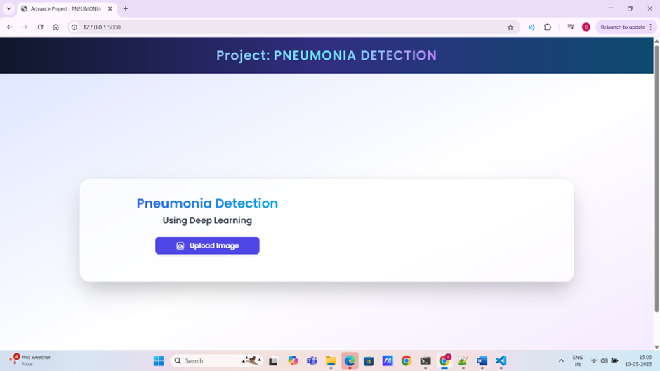
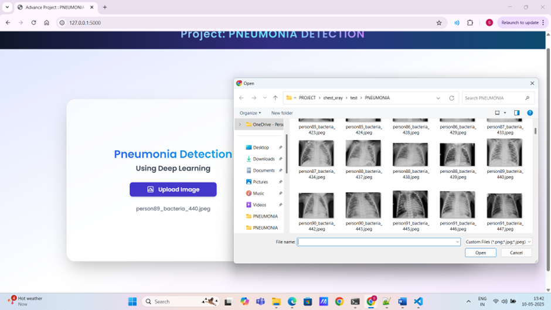
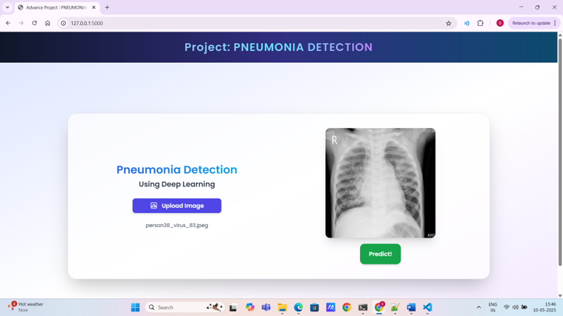
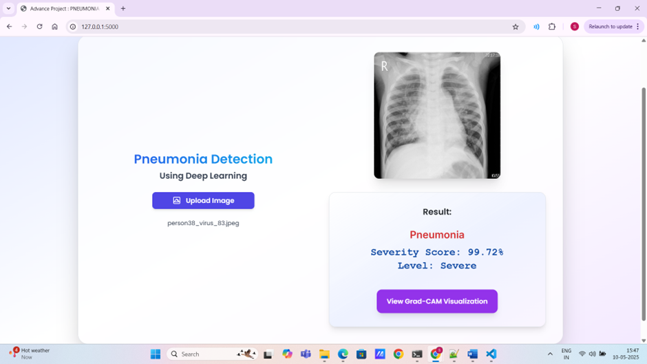
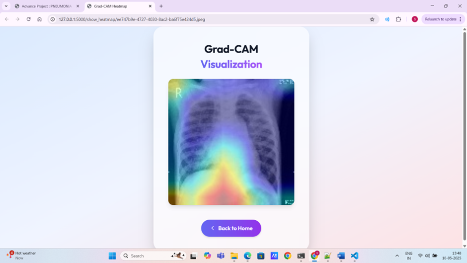

# 🫁 Pneumonia Detection using Deep Learning (VGG19)

This project is a deep learning-based web application that detects pneumonia from chest X-ray images using a fine-tuned VGG19 convolutional neural network. It uses TensorFlow/Keras for modeling and Flask for serving the application.

---

## 📂 Project Structure


├── chest_xray/                # Chest X-ray image dataset\
├── model_weights/                     # Saved model (h5 or pkl)\
├── FlaskApplication/                 # HTML templates (index.html, import.html)\
├── PneumoniaDetection.ipynb  # Main Jupyter Notebook\
├── requirements.txt\
└── README.md


---

## 🚀 Getting Started

### 1. 🔄 Clone the Repository


### 2. 🐍 Create a Virtual Environment

```bash
python -m venv .venv
```

Activate it:

* **Windows**:

  ```bash
  venv\Scripts\activate
  ```

* **macOS/Linux**:

  ```bash
  source venv/bin/activate
  ```

---

### 3. 📦 Install Dependencies

```bash
pip install -r requirements.txt
```

Make sure `requirements.txt` includes:

```
tensorflow
keras
numpy
matplotlib
flask
pillow
```

---

### 4. 📥 Download the Dataset

You can use the [Kaggle Chest X-Ray dataset](https://www.kaggle.com/paultimothymooney/chest-xray-pneumonia).

After downloading:

* Place the `chest_xray` folder inside your project directory.
* It should look like:

```
dataset/
├── test/
├── train/
└── val/
```

If needed, update your notebook path accordingly.

---

### 5. 🧠 Run the Jupyter Notebook

Run all cells in `PneumoniaDetection.ipynb`:

```bash
jupyter notebook
```

The notebook will:

* Load and preprocess the data
* Augment images
* Build and fine-tune the VGG19 model
* Evaluate and save the trained model (`model.h5` or similar)

Make sure the model is saved inside a `model/` folder for the Flask app.

---

### 6. 🌐 Launch the Flask App


Once the model is trained and saved, run the web app:

```bash
cd FlaskApplication

python app.py
```

Then, open your browser and go to:

```
http://127.0.0.1:5000/
```

You can upload an X-ray image to see the prediction (Normal or Pneumonia).

---

## 📸 Sample Outputs
1 Home Page (User Interface)

2 Chest X-ray Upload Interface

3 Preview of Uploaded Chest X-ray Image

4 Pneumonia Detection Result Display

5 Enhanced Result Visualization with Grad-Cam Heatmap
